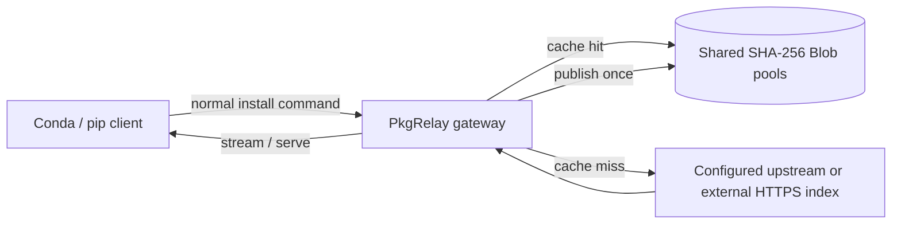
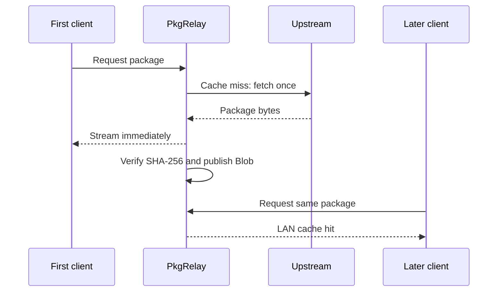
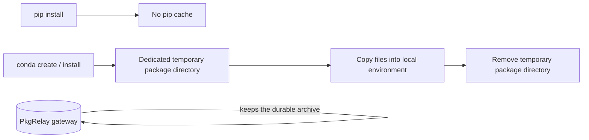

<p align="center">
  
</p>

<h1 align="center">PkgRelay</h1>

<p align="center">A self-hosted, LAN-first cache relay for Conda and pip packages.</p>

<p align="center">
  
  
  
  
  
</p>

<p align="center">
  <a href="README.zh-CN.md">简体中文</a> · <a href="#quick-start">Quick start</a> · <a href="#client-setup">Client setup</a> · <a href="#architecture">Architecture</a>
</p>

---

PkgRelay makes the gateway the durable package cache. Conda and pip still resolve dependencies and select versions; PkgRelay fetches a missing artifact once, stores it by SHA-256, then distributes it over the LAN.

## Highlights

- **Two physical pools** — one shared `conda` pool and one shared `pip` pool.
- **Content-addressed storage** — identical artifacts share a Blob across routes.
- **Transparent commands** — users keep normal `conda`, `pip`, and `pip3` workflows.
- **External pip indexes** — CUDA commands keep their original `--index-url`; the client rewrites their transport path through PkgRelay.
- **Streaming cache misses** — large wheels are forwarded while the gateway writes them to cache.
- **Transient client downloads** — pip does not retain a cache; Conda uses and removes a dedicated staging directory after package operations.
- **Web console** — browse cache pools, Conda channels, package files, size, and hit counts.

## Architecture





## Quick start

### Deploy the gateway

```bash
git clone https://github.com/sea-with-sakura/PkgRelay.git
cd PkgRelay
cp config.example.yaml config.yaml
docker compose up -d --build
curl http://127.0.0.1:45612/healthz
```

Open the web console at `http://<gateway-ip>:45612/`.

The default Compose file mounts central data at `/4090data1/pkgrelay/data`. Change that host path in `docker-compose.yml` if your storage layout differs.

## Client setup

Run once for each user in a Bash session:

```bash
wget -qO /tmp/setenv.sh http://<gateway-ip>:45612/bootstrap/setenv.sh && bash /tmp/setenv.sh && exec bash -l
```

Choose **Install**. PkgRelay backs up the original user `.condarc` once and restores it on **Uninstall**.

## Verified commands

After setup, these commands use the gateway without writing its address into the command.

```bash
# Conda: configured defaults and conda-forge
conda create -n demo python=3.12
conda install -n demo numpy

# Conda: explicit channels are also routed by the gateway
conda create -n torch-env python=3.12 -c pytorch -c conda-forge

# pip: default PyPI route
pip install gpustat

# pip: keep the official CUDA index; PkgRelay rewrites transport only
pip install torch torchvision --index-url https://download.pytorch.org/whl/cu128
```

Do **not** manually replace `--index-url` with a gateway URL. The first request may fetch upstream; later clients receive the same file from the LAN cache.

> Use `pip` or `pip3` for gateway routing. `python -m pip` inherits the no-local-cache setting from the current Bash session, but does not use the Bash URL-rewrite function.

## Cache lifecycle



| Component | Persistent location | Notes |
| --- | --- | --- |
| Gateway packages and metadata | Host directory mounted at `/data` | Shared cache of record. |
| Conda / pip environments | Client machine | Installed environments, not download cache. |
| New pip cache | None | The client exports `PIP_NO_CACHE_DIR=1`. |
| New Conda package cache | None after transaction | Staging directory is cleared after package-changing commands. |

Existing legacy directories such as `miniconda3/pkgs` are not deleted automatically: older environments may use symlinks into them.

## Configure upstreams

All source policy lives in `config.yaml`; clients only talk to PkgRelay.

```yaml
sources:
  conda-forge:
    upstreams:
      - https://your-conda-mirror/anaconda/cloud/conda-forge
      - https://conda.anaconda.org/conda-forge
    metadata_ttl_seconds: 600
    fallback_on_not_found: true

  pypi:
    kind: pypi
    upstreams:
      - https://your-pypi-mirror
      - https://pypi.org
    metadata_ttl_seconds: 600
    fallback_on_not_found: true
```

Package archives remain immutable once cached. Conda and PyPI index metadata refresh after their configured TTL, using HTTP validators where available.

## Import existing packages

Run on the gateway host. The source directory is never changed.

```bash
./import/import-cache.sh conda /path/to/miniconda3/pkgs
./import/import-cache.sh pypi /path/to/pip-cache
./import/import-cache.sh --dry-run pypi /path/to/pip-cache
```

Migrate a user's old archives before pruning them:

```bash
~/.local/share/pkgrelay/cache-sync.sh --sync
~/.local/share/pkgrelay/cache-sync.sh --prune
```

## Operations

```bash
./rebuild.sh
curl http://127.0.0.1:45612/healthz
./reset-cache.sh --yes  # destructively resets central cache only
```

Avoid rebuilding while large downloads are active: recreating the container briefly interrupts in-flight connections.

## Security and scope

- Designed for a trusted LAN. Restrict port `45612` or add TLS/reverse proxy for wider deployment.
- Dynamic **HTTPS** pip indexes are accepted for vendor/CUDA indexes.
- Conda channels must be declared in `config.yaml`; PkgRelay is not a generic Conda proxy.
- PkgRelay never chooses versions or dependencies. Conda and pip remain the authorities.

## Project layout

```text
app/       FastAPI gateway, cache store, importer, and web console
client/    Bootstrap installer and Bash client wrappers
import/    Host-side import utility
nginx/     Optional edge reverse-proxy configuration
tests/     Gateway, cache, import, and dashboard tests
```

## Contributing

Issues and pull requests are welcome. Please preserve the two-pool, content-addressed storage model and add tests for behavior changes where practical.

## License

No license has been selected yet.
