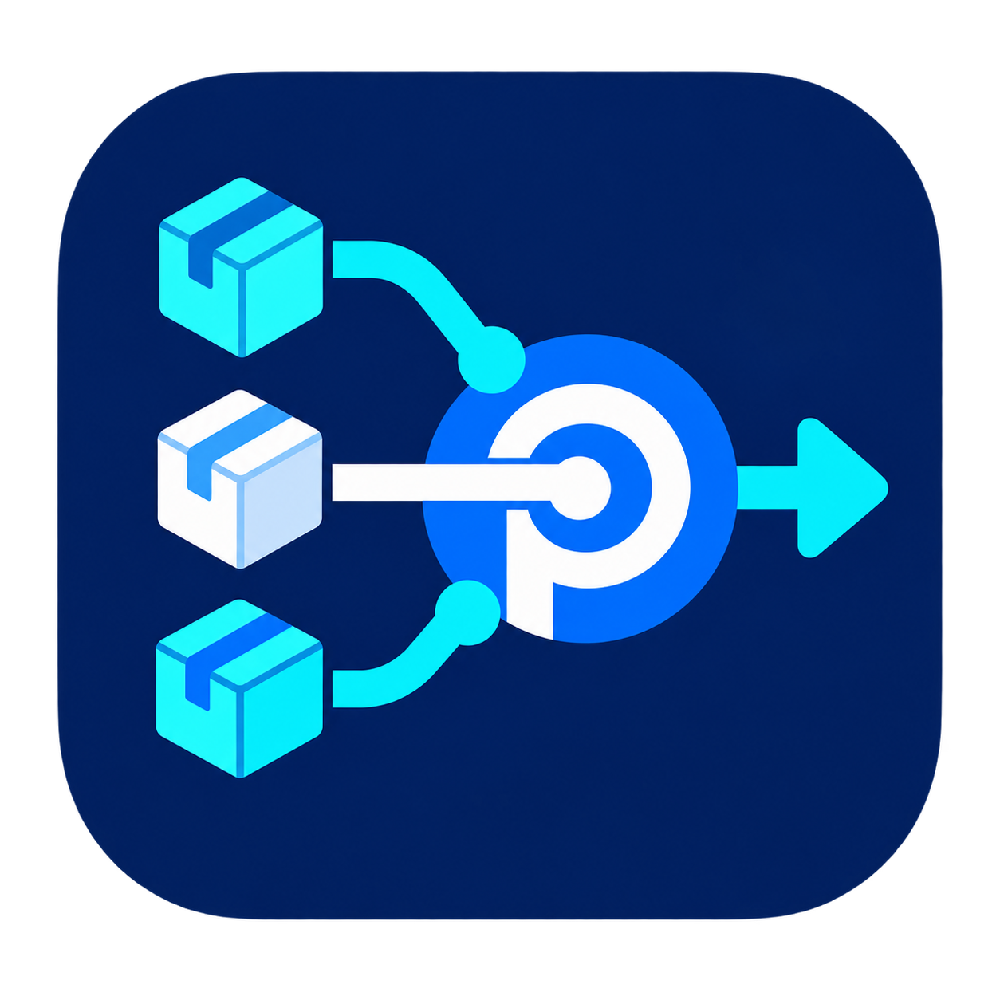
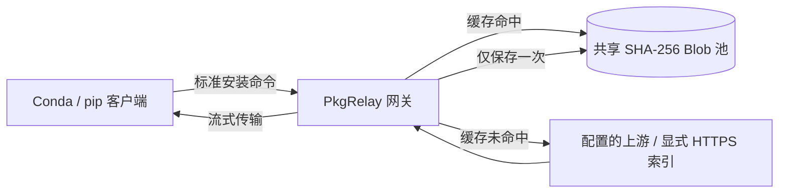
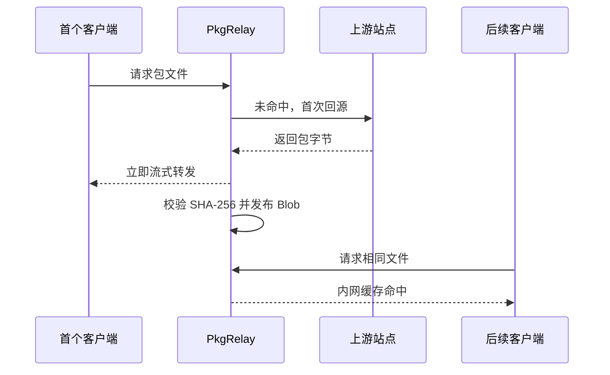
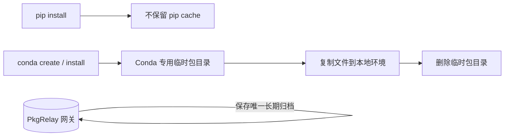

<p align="center">
  
</p>

<h1 align="center">PkgRelay</h1>

<p align="center">面向内网的 Conda / pip 自托管包缓存中转站。</p>

<p align="center">
  
  
  
  
</p>

<p align="center">
  <a href="README.md">English</a> · <a href="#快速开始">快速开始</a> · <a href="#客户端接入">客户端接入</a> · <a href="#工作原理">工作原理</a>
</p>

---

PkgRelay 将可下载包的长期缓存集中在一个网关。Conda 与 pip 继续自行负责依赖解析和版本选择；网关只负责首次回源、按 SHA-256 去重保存，并向后续内网请求分发缓存文件。

## 特性

- **两个物理缓存池**：仅 `conda` 与 `pip` 两个共享池。
- **按内容去重**：不同路由发现的相同文件只保存一个 Blob。
- **不改变日常命令**：继续使用标准 `conda`、`pip`、`pip3`。
- **支持外部 pip 索引**：PyTorch CUDA 等 `--index-url` 保持原样书写，由客户端经网关转发。
- **大文件边传边存**：首次下载 wheel 时，网关立即向 pip 转发，同时写入中央缓存。
- **客户端不保留新的下载缓存**：pip 禁用本地 cache；Conda 使用临时目录，复制进环境后清理。
- **高吞吐命中分发**：命中 Blob 自动转交给专用静态分发进程；首次未命中仍保持边下载边转发。
- **Web 控制台**：浏览 Conda Channel、包文件、缓存大小、命中次数与使用汇总。
- **使用汇总**：按机器与用户汇总包下载、内网分发量、命中率和节省的外网流量。

## 工作原理





## 快速开始

### 部署网关

```bash
git clone https://github.com/sea-with-sakura/PkgRelay.git
cd PkgRelay
cp config.example.yaml config.yaml
docker compose up -d --build
curl http://127.0.0.1:45612/healthz
```

Web 控制台地址为 `http://<网关IP>:45612/`。

默认 Compose 配置将中央数据挂载到宿主机 `/4090data1/pkgrelay/data`。若存储位置不同，请先修改 `docker-compose.yml` 中的宿主机路径。网关与静态分发进程采用 Linux Docker 的 host network 以避免 bridge/NAT 限制缓存分发速度；客户端仍只配置并访问 `45612`，命中包的内部跳转由工具自动处理。

## 客户端接入

每台机器、每个用户在 Bash 中执行一次：

```bash
wget -qO /tmp/setenv.sh http://<网关IP>:45612/bootstrap/setenv.sh && bash /tmp/setenv.sh && exec bash -l
```

选择 **Install** 即可。安装器会在首次运行时备份用户原有 `.condarc`；选择 **Uninstall** 时恢复。安装时会生成一个仅用于网关统计的随机客户端标识，并登记当前机器名和用户名；已有客户端重新执行一次本命令即可启用使用统计。

客户端会在使用 `conda`、`pip` 或 `pip3` 时低频检查网关版本。若网关已发布新版客户端，终端会显示同一条接入命令；重新执行即可更新，不会中断当前安装。

## 使用统计

首页的“使用概览”默认展示近 30 天的数据：活跃用户、活跃机器、内网分发量，以及由缓存命中避免的外网下载量。只统计实际包归档，不统计 Conda `repodata` 或 pip `simple` 索引请求。

## 已验证指令

接入后，以下命令无需在命令中手写网关地址，均会经过 PkgRelay：

```bash
# Conda：网关下发的 conda-forge + defaults
conda create -n demo python=3.12
conda install -n demo numpy

# Conda：显式 Channel 也会由网关处理
conda create -n torch-env python=3.12 -c pytorch -c conda-forge

# pip：默认 PyPI
pip install gpustat

# pip：保留 PyTorch CUDA 官方索引；传输路径由客户端自动改写到网关
pip install torch torchvision --index-url https://download.pytorch.org/whl/cu128
```

不要手动把 `--index-url` 改为网关地址。首次请求由网关回源并缓存；后续机器请求同一文件时直接走内网缓存。

> 网关路由请使用 `pip` 或 `pip3`。`python -m pip` 会继承当前 Bash 的“禁用本地缓存”设置，但不会经过 Bash 的 URL 改写函数。

## 缓存生命周期



| 组件 | 长期位置 | 说明 |
| --- | --- | --- |
| 网关包与元数据 | 服务端挂载的 `/data` | 唯一共享下载缓存。 |
| Conda / pip 环境 | 客户端本机 | 用户安装后的环境，不是下载缓存。 |
| 新 pip cache | 不保留 | 客户端导出 `PIP_NO_CACHE_DIR=1`。 |
| 新 Conda 包缓存 | 事务结束后不保留 | 专用临时目录会在包操作结束后清理。 |

历史目录（如 `miniconda3/pkgs`）不会被自动删除，以免破坏可能通过软链接依赖它的旧环境。

## 上游配置

所有上游策略只写在服务端 `config.yaml`；客户端只访问 PkgRelay。

```yaml
sources:
  conda-forge:
    upstreams:
      - https://your-conda-mirror/anaconda/cloud/conda-forge
      - https://conda.anaconda.org/conda-forge
    metadata_ttl_seconds: 600
    fallback_on_not_found: true

  pypi:
    kind: pypi
    upstreams:
      - https://your-pypi-mirror
      - https://pypi.org
    metadata_ttl_seconds: 600
    fallback_on_not_found: true
```

包归档一旦缓存即视为不可变；Conda / PyPI 索引元数据在 TTL 到期后刷新，并尽可能使用 ETag、Last-Modified 验证。

## 导入已有包

在网关宿主机执行，原目录不会被修改：

```bash
./import/import-cache.sh conda /path/to/miniconda3/pkgs
./import/import-cache.sh pypi /path/to/pip-cache
./import/import-cache.sh --dry-run pypi /path/to/pip-cache
```

用户历史归档迁移到网关后再清理：

```bash
~/.local/share/pkgrelay/cache-sync.sh --sync
~/.local/share/pkgrelay/cache-sync.sh --prune
```

## 运维

```bash
./rebuild.sh
curl http://127.0.0.1:45612/healthz
./reset-cache.sh --yes  # 仅删除中央缓存，不可恢复
```

大包下载进行中请避免重建服务；容器重建会短暂中断正在进行的客户端连接。

请用 `./rebuild.sh` 发布更新：它会把当前 Git commit 写入网关版本，供旧客户端识别更新。

## 安全与边界

- PkgRelay 面向可信内网；更大范围部署时请限制端口 `45612`，或配置 TLS / 反向代理。
- 网关接受动态 **HTTPS** pip 索引，以支持 CUDA、厂商等额外索引而不改写用户命令。
- Conda Channel 必须在 `config.yaml` 中显式配置；它不是通用 Conda 代理。
- PkgRelay 不决定版本、依赖或 solver 行为；这些仍由 Conda 与 pip 决定。

## 目录结构

```text
app/       FastAPI 网关、缓存存储、导入与 Web 控制台
client/    Bootstrap 安装器与 Bash 客户端包装器
import/    宿主机侧导入工具
tests/     网关、缓存、导入与仪表盘测试
```

## 参与贡献

欢迎提交 Issue 与 Pull Request。行为变更请尽量补充测试，并保持“两池 + 内容寻址 Blob”的核心模型。

## 许可证

暂未选择许可证。
